# Relatório Técnico — Tech Challenge Fase 1 (IADT)
## Sistema de Apoio ao Diagnóstico de Câncer de Mama com Machine Learning

---

## 1. Problema e contexto

Uma rede de hospitais especializados no atendimento à mulher busca um sistema inteligente de suporte ao diagnóstico, capaz de acelerar a triagem e apoiar decisões médicas. Nesta fase, o foco é construir a base de Machine Learning que analise dados médicos estruturados e identifique padrões de risco.

Escolhemos o problema de **classificação de câncer de mama**: a partir de características morfológicas do núcleo celular — extraídas de imagens digitalizadas de punção aspirativa por agulha fina (FNA) — o modelo classifica o tumor como **maligno** ou **benigno**. É um problema de altíssima relevância clínica: o câncer de mama é uma das principais causas de mortalidade feminina, e a detecção precoce impacta diretamente a sobrevida.

**Dataset:** Breast Cancer Wisconsin (Diagnostic), sugerido no próprio enunciado. São 569 casos e 30 features numéricas descrevendo o núcleo celular (raio, textura, perímetro, área, suavidade, compacidade, concavidade, pontos côncavos, simetria e dimensão fractal), cada uma em três agregações: média (`mean`), erro padrão (`se`) e pior valor (`worst`). A variável alvo é `diagnosis` (M = maligno, B = benigno).

---

## 2. Discussões da análise exploratória (EDA)

**Distribuição do alvo.** A base tem 357 casos benignos (62,7%) e 212 malignos (37,3%). É um desbalanceamento moderado — não extremo, mas suficiente para justificar o uso de métricas além da acurácia (recall e F1) e a estratificação no split treino/teste.

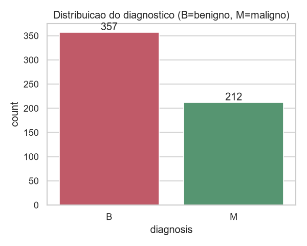

**Qualidade dos dados.** A base é limpa. Encontramos apenas duas colunas não-informativas: `id` (identificador) e `Unnamed: 32` (coluna totalmente vazia, artefato do arquivo CSV original). Nenhum valor ausente nas 30 features.

**Distribuições por diagnóstico.** Ao comparar as densidades das features entre os grupos, observa-se separação visual clara: tumores malignos apresentam consistentemente maior raio, área, concavidade e número de pontos côncavos. Isso é coerente com a biologia — células malignas tendem a ter núcleos maiores e contornos mais irregulares.

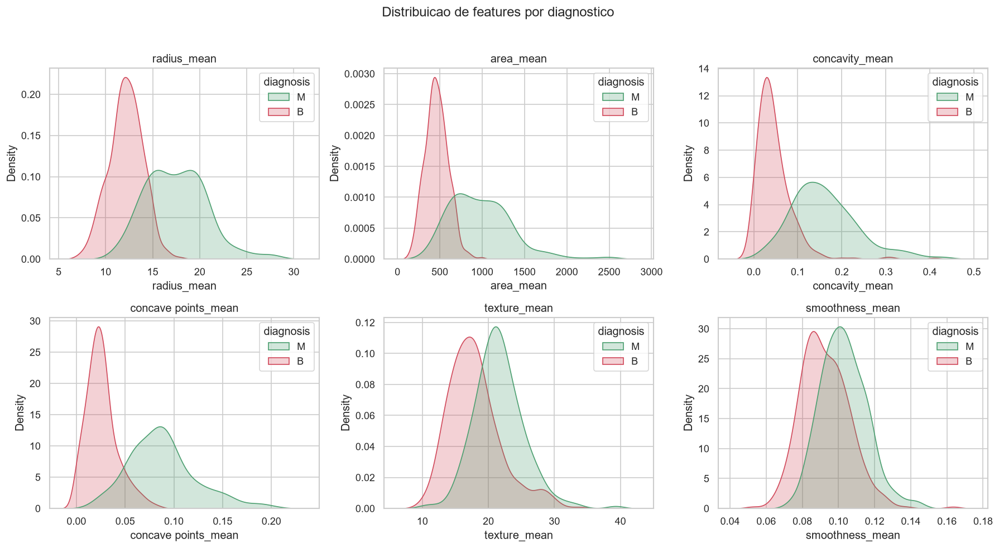

**Correlação com o alvo.** As features mais correlacionadas com a malignidade são:

| Feature | Correlação (Pearson) |
|---|---|
| concave points_worst | 0,794 |
| perimeter_worst | 0,783 |
| concave points_mean | 0,777 |
| radius_worst | 0,776 |
| perimeter_mean | 0,743 |
| area_worst | 0,734 |

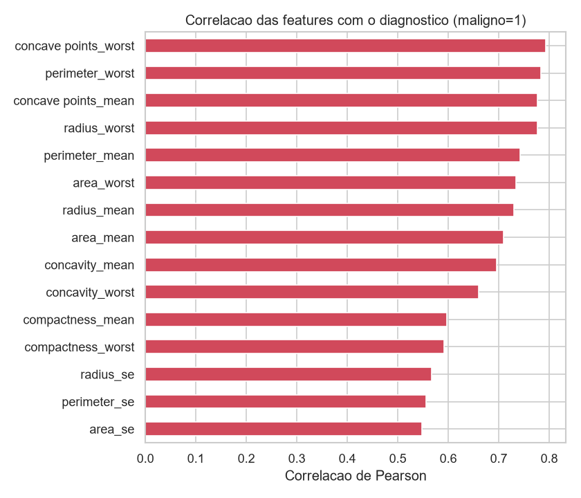

Nota-se também forte correlação **entre** as features (raio, perímetro e área medem essencialmente a mesma dimensão do núcleo). Essa multicolinearidade é esperada e foi levada em conta na escolha e no pré-processamento dos modelos.

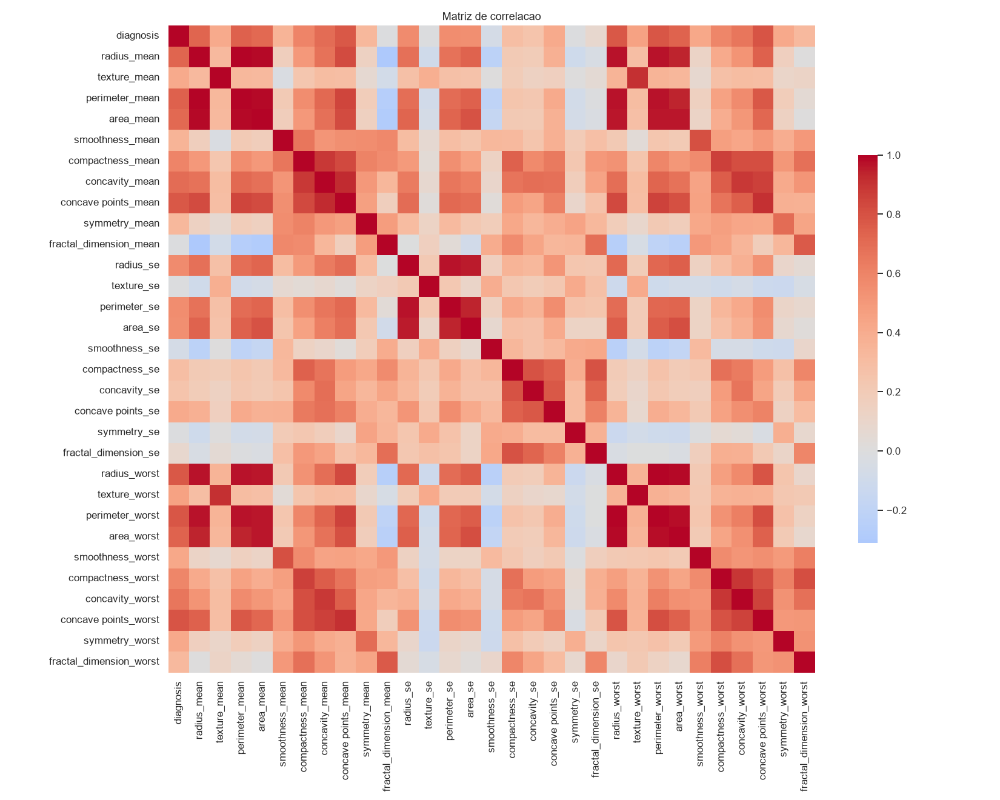

---

## 3. Estratégias de pré-processamento

O pipeline de pré-processamento foi implementado em Python (scikit-learn) com as seguintes etapas:

1. **Remoção de colunas não-informativas** (`id` e a coluna vazia).
2. **Codificação do alvo:** `diagnosis` convertido para numérico (M = 1, B = 0), definindo o maligno como a classe positiva.
3. **Separação treino/teste:** divisão 80/20 com `train_test_split` e `stratify=y`, preservando a proporção de classes nos dois conjuntos (455 casos de treino, 114 de teste).
4. **Padronização:** `StandardScaler` aplicado às features. É essencial para modelos sensíveis à escala, como KNN e Regressão Logística.
5. **Encapsulamento em `Pipeline`:** o scaler foi colocado dentro de um `sklearn.pipeline.Pipeline` junto com cada classificador. Isso garante que o `StandardScaler` seja ajustado **apenas** nos dados de treino e aplicado ao teste, evitando *data leakage* e tornando o processo reproduzível.

---

## 4. Modelos usados e por quê

O requisito mínimo é duas técnicas; usamos **seis modelos de base**, cobrindo todos os principais paradigmas, e um **Stacking** que os combina:

- **Regressão Logística** — baseline linear e altamente interpretável; seus coeficientes indicam o peso de cada feature.
- **Árvore de Decisão** (profundidade máxima 5) — regras não-lineares, fáceis de explicar e compatíveis com SHAP.
- **K-Nearest Neighbors (KNN, k=5)** — classifica por similaridade (paradigma baseado em distância).
- **Random Forest** (300 árvores) — ensemble de árvores; robusto e forte em dados tabulares.
- **Gradient Boosting** — ensemble sequencial, tipicamente o melhor em dados tabulares.
- **SVM** (kernel RBF) — separa as classes com margem máxima.

**Stacking (meta-aprendizado).** Em vez de escolher o melhor modelo, um `StackingClassifier` usa os seis como base (nível 0) e uma **Regressão Logística** como meta-modelo (nível 1), que aprende a melhor combinação das previsões. Ele emprega validação cruzada interna (5-fold) para gerar as previsões de base sem vazamento de dados. A escolha cobre os paradigmas linear, de regras, de distância, de ensembles e de margem — permitindo comparação justa e um ensemble final de alto nível.

---

## 5. Resultados e interpretação

### 5.1. Métricas

**Escolha da métrica.** No contexto clínico, a classe positiva é o tumor maligno e o erro mais grave é o **falso negativo** — classificar como benigno um tumor que é maligno, atrasando o tratamento. Por isso a métrica prioritária é o **recall da classe maligna** (sensibilidade), acompanhada do **F1-score** (equilíbrio entre recall e precisão). A acurácia é reportada, mas não é decisiva sozinha em dados desbalanceados.

| Modelo | Accuracy | Recall (maligno) | F1 (maligno) | CV Acc | CV Recall |
|---|---|---|---|---|---|
| **Stacking** | **0,983** | **0,952** | **0,976** | 0,976 | 0,959 |
| SVM | 0,974 | 0,929 | 0,963 | 0,974 | 0,953 |
| Random Forest | 0,974 | 0,929 | 0,963 | 0,958 | 0,935 |
| Regressão Logística | 0,965 | 0,929 | 0,951 | 0,971 | 0,947 |
| Gradient Boosting | 0,965 | 0,905 | 0,950 | 0,954 | 0,935 |
| KNN | 0,956 | 0,905 | 0,938 | 0,963 | 0,918 |
| Árvore de Decisão | 0,921 | 0,833 | 0,886 | 0,934 | 0,888 |

As duas últimas colunas trazem a média da **validação cruzada 5-fold** no treino, confirmando que os números do teste não são fruto de uma divisão sortuda.

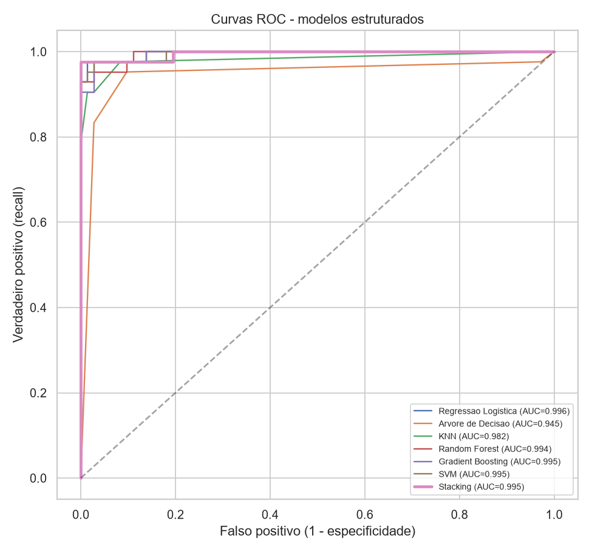

A curva ROC (e a área sob ela, AUC) resume a capacidade de separação de cada modelo em todos os limiares: quanto mais a curva "abraça" o canto superior esquerdo, melhor. Todos os modelos têm AUC alto (0,945–0,996).

### 5.2. Interpretação

O **Stacking** foi o melhor em todas as métricas (AUC 0,995; apenas **2 erros** em 114 casos de teste), superando cada modelo individual — o esperado, já que combina paradigmas que erram em lugares diferentes. Vale a ressalva honesta: como a base é bem separada, o ganho sobre a Regressão Logística (0,965) é pequeno, e o stacking reduz a interpretabilidade. Por isso, **para uso real, a Regressão Logística continua atraente pela transparência** — o stacking demonstra domínio da técnica e arranca a última fração de desempenho.

### 5.3. Ajuste de limiar orientado ao recall (finalidade clínica)

Um modelo médico não deve ser avaliado só pela acurácia: é preciso **definir sua finalidade**. Aqui, a finalidade é **não deixar passar um câncer** — minimizar o falso negativo, mesmo que isso reduza a acurácia geral. Por padrão, os classificadores decidem no limiar de probabilidade 0,5; ajustando esse corte, controlamos deliberadamente o trade-off entre os quadrantes da matriz de confusão.

Aplicamos essa análise ao Stacking (melhor modelo):

| Limiar | Falsos negativos | Falsos positivos |
|---|---|---|
| 0,50 (padrão) | 2 | 0 |
| 0,02 (recall = 100%) | 0 | 18 |

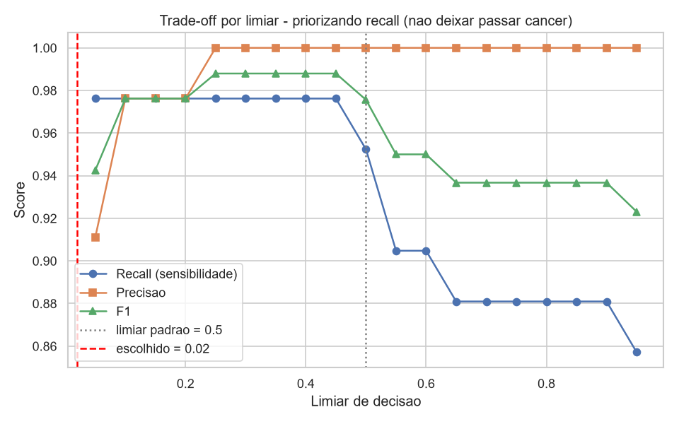

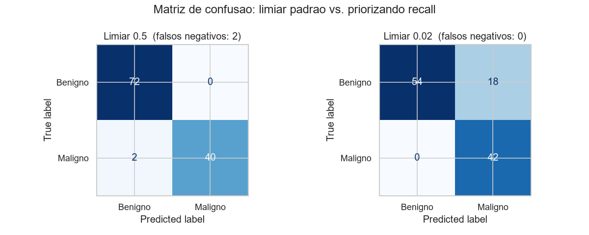

Ou seja: para **eliminar todos os falsos negativos** (zero câncer despercebido) no conjunto de teste, pagamos o preço de **18 falsos positivos a mais** — 18 pacientes que fariam um exame de confirmação sem necessidade. Num contexto clínico, esse é frequentemente um **custo aceitável**: um exame extra é muito menos grave do que um diagnóstico perdido. A decisão final do limiar cabe à equipe médica, conforme a política de triagem. O importante é que a acurácia mais baixa nesse cenário **não é uma piora do modelo — é uma escolha consciente alinhada à finalidade**.

### 5.4. Explicabilidade

**Feature importance (Regressão Logística).** Os coeficientes confirmam que features ligadas a tamanho e irregularidade do núcleo empurram a previsão para maligno.

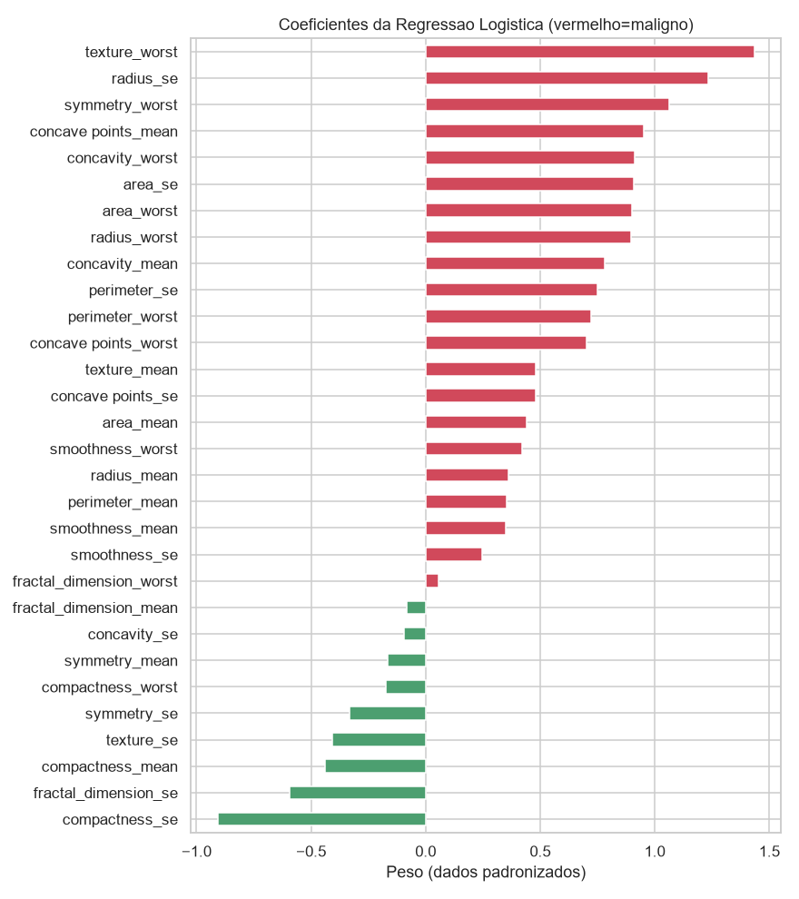

**SHAP (Árvore de Decisão).** O gráfico de valores SHAP mostra o impacto de cada feature nas previsões individuais. As mais determinantes — `perimeter_worst`, `concave points_worst` e `area_worst` — coincidem com as mais correlacionadas na EDA e com os coeficientes da Regressão Logística. Valores altos dessas medidas aumentam a probabilidade de malignidade.

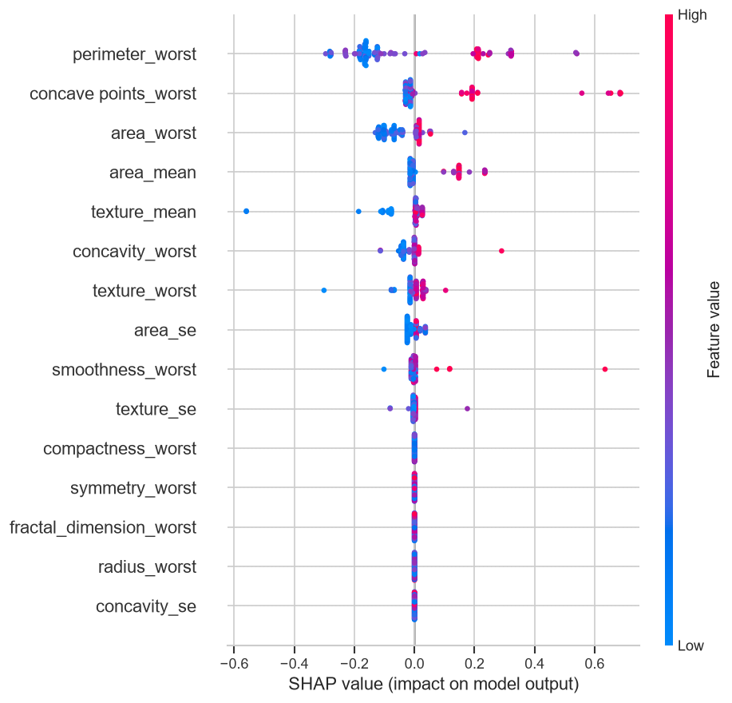

A convergência entre três abordagens independentes (correlação, coeficientes e SHAP) reforça a confiança na interpretação: **o tamanho e a irregularidade do contorno do núcleo celular são os principais indicadores de malignidade**, o que é consistente com o conhecimento médico.

---

## 6. Fase extra — Visão Computacional (CNN em mamografias)

Como item extra, implementamos um classificador de imagens de mamografia com redes neurais convolucionais (CNN), atacando o mesmo problema (benigno vs. maligno) por outra modalidade de dado.

**Dataset.** CBIS-DDSM. Usamos os recortes de lesão (ROI "cropped"), ligados aos rótulos de patologia pelos metadados DICOM. São 3.566 imagens (2.110 benignas / 1.456 malignas), com o split oficial treino/teste (2.862 / 704) e ~15% do treino reservado para validação.

**Abordagem.** Transfer learning com redes pré-treinadas na ImageNet, implementadas em PyTorch (treino na GPU NVIDIA). O treino foi feito em duas fases: (1) *warmup* de 5 épocas com a base congelada, treinando apenas a nova cabeça de classificação; (2) *fine-tuning* da rede com learning rate baixo (1e-4). O desbalanceamento foi tratado com `pos_weight` na função de perda, e aplicamos data augmentation (flips e rotações). O early stopping por val_loss selecionou o melhor checkpoint.

**Comparação de arquiteturas.** Treinamos e comparamos quatro arquiteturas, avaliando no conjunto de teste (704 imagens):

| Arquitetura | Accuracy | Recall (maligno) | F1 (maligno) |
|---|---|---|---|
| **ResNet18** (escolhida) | 0,642 | **0,746** | 0,621 |
| DenseNet121 | 0,644 | 0,736 | 0,618 |
| EfficientNet-B0 | 0,668 | 0,703 | 0,624 |
| MobileNetV2 | 0,675 | 0,696 | 0,626 |

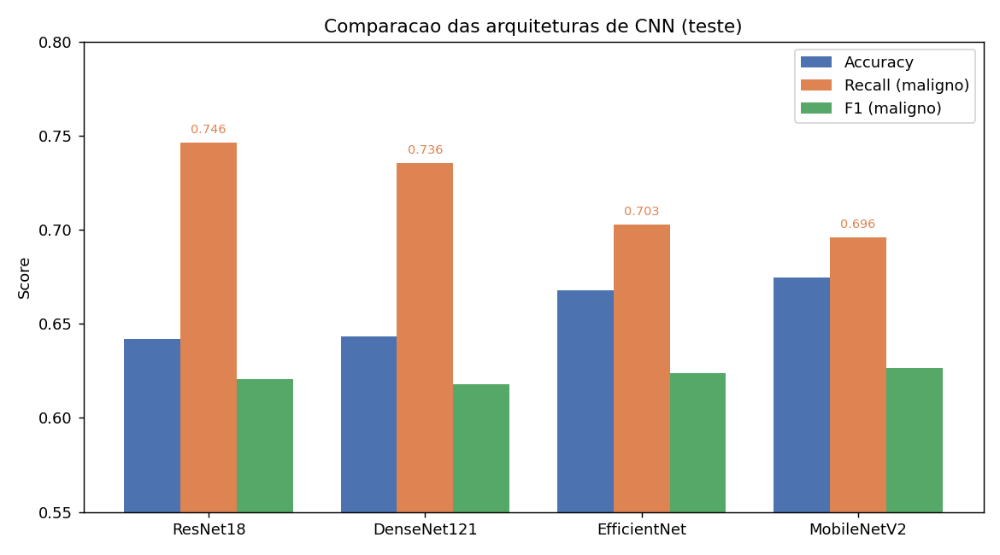

**Escolha.** As quatro ficaram muito próximas (F1 entre 0,618 e 0,626), o que indica que o gargalo é a dificuldade intrínseca da tarefa, não a arquitetura. Coerente com a métrica prioritária do projeto (**recall da classe maligna** — não deixar passar câncer), escolhemos a **ResNet18**, que obteve o maior recall (0,746). A DenseNet121 — arquitetura clássica de imagem médica — ficou em segundo, muito perto.

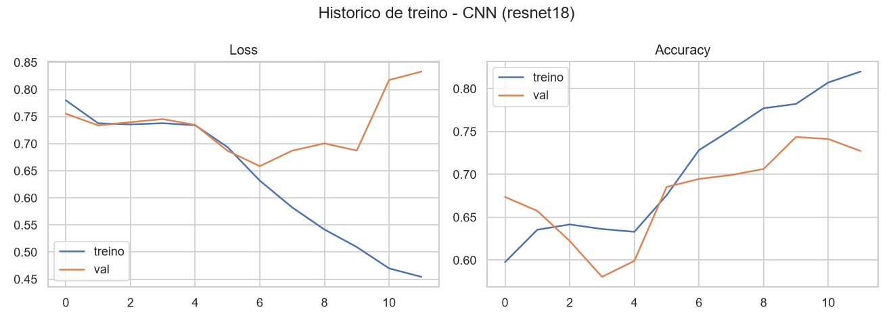

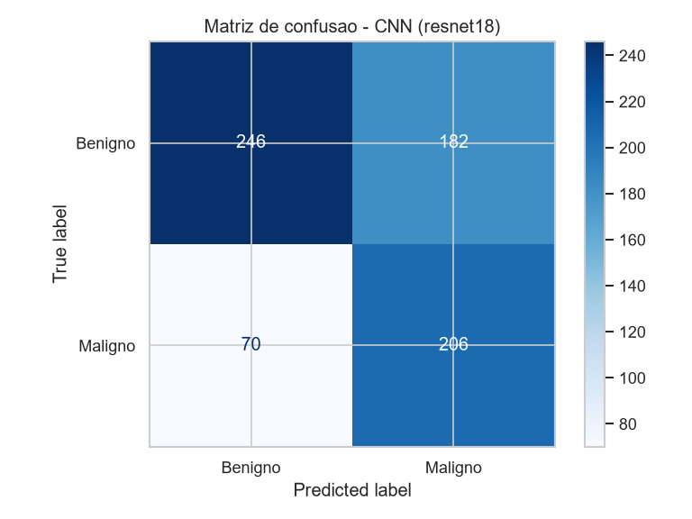

As curvas de treino mostram o comportamento esperado: a perda de treino cai continuamente enquanto a de validação estagna e oscila — início de overfitting, contido pelo early stopping.

**Interpretação e limitações.** O desempenho (~64–68%) é modesto frente ao módulo estruturado (98%), o que é esperado: o CBIS-DDSM em patches é uma tarefa reconhecidamente difícil, as features da ImageNet vêm de fotos naturais (não de imagens médicas em tons de cinza) e a resolução usada (128×128) descarta detalhes finos. Ainda assim, o recall de 0,75 mostra que o modelo prioriza a detecção dos casos de risco. Caminhos para melhorar: maior resolução, mais dados e uso das mamografias completas. Também aqui o modelo é uma ferramenta de apoio — não um substituto do laudo médico.

---

## 7. Sistema multimodal — roteamento por modalidade

Temos duas fontes de dados de câncer de mama, mas de **pacientes diferentes** (exames tabulares e mamografias). Como não há correspondência por paciente, **não** é válido fundir os dois resultados num único número — isso misturaria pessoas distintas e produziria uma métrica artificial.

A solução correta, adotada aqui, é um **sistema com roteamento por modalidade**: um ponto de entrada único, `diagnosticar()`, que recebe *ou* um exame tabular *ou* uma imagem, reconhece o tipo e encaminha para o modelo especialista adequado (Stacking para exames; CNN para imagens), devolvendo um laudo padronizado. É a arquitetura usada em sistemas clínicos reais e está demonstrada no notebook `notebooks/02_estudo_integrado.ipynb`, junto de um estudo comparativo (métricas e curvas ROC das duas modalidades).

Como reforço de produto, o módulo estruturado também passou a salvar o artefato treinado (`outputs/modelo_estruturado_stacking.joblib`) e um arquivo de metadados com o schema e os limiares sugeridos (`outputs/modelo_estruturado_meta.json`), permitindo inferência reproduzível por CLI em novos exames tabulares.

---

## 8. Experimento — Radiômica + ML clássico vs. CNN

Testamos uma hipótese interessante: *e se, em vez de uma CNN, extraíssemos features numéricas das mamografias e usássemos o nosso Stacking?* Isso transforma o problema de imagem em tabular. Extraímos **76 features** de cada recorte — intensidade, textura GLCM/Haralick, LBP, Gabor, gradiente/bordas e forma da lesão (via limiar de Otsu) — e treinamos os mesmos modelos, com `class_weight='balanced'` e ajuste de limiar, para uma comparação **justa** (mesma prioridade de recall dos dois lados).

**Resultados (mesmo conjunto de teste, 704 imagens):**

| Abordagem | Recall (maligno) | F1 (maligno) | AUC |
|---|---|---|---|
| **CNN (ResNet18)** | 0,746 | **0,621** | — |
| Radiômica — SVM (melhor F1) | 0,710 | 0,567 | 0,625 |
| Radiômica — Gradient Boosting | 0,460 | 0,488 | 0,644 |
| Radiômica — Stacking | 0,428 | 0,464 | 0,638 |


**Interpretação — a CNN venceu, e o AUC explica por quê.** O balanceamento elevou bastante o recall dos modelos de radiômica (de ~0,43 para ~0,70-0,77), mas o **AUC ficou preso em ~0,60-0,64** — mesmo com as 76 features ricas. O AUC mede o *sinal real* de separação, independente do limiar; balanceamento e ajuste de limiar movem o recall, mas **não criam sinal novo**. Ou seja, batemos no teto do que features feitas à mão conseguem extrair desses recortes.

A radiômica só alcança recall muito alto (0,92, via limiar 0,25) **sacrificando a precisão de forma inviável** (343 falsos positivos — ~80% das pacientes benignas seriam flagradas). A CNN, ao contrário, entrega recall 0,75 com F1 0,62 (equilíbrio). 

**Conclusão.** Nesta tarefa, **a CNN aprende representações melhores dos pixels do que conseguimos projetar manualmente**. O experimento não é um fracasso: é uma comparação honesta que *embasa com evidência (o AUC)* a escolha da abordagem por deep learning para as imagens. 
---

## 9. Discussão crítica — o modelo pode ser usado na prática?

Sim, **como ferramenta de apoio e triagem — nunca como substituto do médico.**

Pontos favoráveis:
- Desempenho alto e consistente, com recall de 92,9% para a classe maligna.
- Modelo interpretável e auditável: o profissional consegue entender o porquê de cada previsão via SHAP e coeficientes, o que é fundamental para confiança e responsabilização em saúde.
- Pipeline reproduzível e sem vazamento de dados.

Limitações e cuidados:
- Dataset relativamente pequeno (569 casos) e de fonte única; features derivadas de um protocolo específico de imagem (FNA). Generalização para outras populações e equipamentos exige validação externa.
- Mesmo 3 falsos negativos em 114 casos não são desprezíveis num contexto clínico — em produção seria necessário calibrar o limiar de decisão para minimizar ainda mais os falsos negativos, aceitando mais falsos positivos (que geram exames adicionais, mas não deixam passar um câncer).
- Uso real demandaria aprovação regulatória e ética, monitoramento contínuo e integração ao fluxo de trabalho médico.

**Conclusão.** O sistema **sinaliza risco** e organiza a triagem, mas o diagnóstico e a conduta são sempre responsabilidade final do médico. O projeto entrega uma base funcional e bem fundamentada de Machine Learning, cumprindo integralmente os requisitos da Fase 1: análise exploratória, pré-processamento, múltiplos modelos, avaliação com métricas adequadas ao problema e explicabilidade.

---

## 10. Reprodução

O projeto é um pacote Python (*src layout*) com um ponto de entrada único:

```
pip install -e .                     # instala o pacote
python -m techchallenge              # roda o módulo estruturado completo
python -m techchallenge --com-cnn    # também treina a CNN (requer torch/GPU)
tc-prever-estruturado --csv exame.csv
```

Para a demonstração visual, há o notebook `notebooks/01_analise_breast_cancer.ipynb`. Os gráficos, métricas e modelos são gerados na pasta `outputs/`. Instruções completas de instalação (incluindo PyTorch com GPU) estão no `README.md`.
